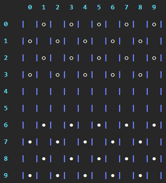

# Jeu de dames
_Créé par Célian Lesage_


[](https://forthebadge.com) [](https://forthebadge.com)
## Pour commencer

Requiert [Python](https://www.python.org/downloads/).

### Modules requis :

* [Numpy](https://github.com/numpy/numpy)
* [Rich](https://github.com/Textualize/rich)
* [Art](https://github.com/sepandhaghighi/art)
```powershell
python -m pip install numpy
```
```powershell
python -m pip install rich
```
```powershell
python -m pip install art
```

Le jeu est compatible Windows et Linux et peut être exécuté depuis un terminal cmd/powershell/python/vscode...

>`python /chemin/du/fichier/damesV4.py`

## Comment jouer ?
Le jeu respècte les [règles officielles du jeu de Dames](http://www.ffjd.fr/Web/index.php?page=reglesdujeu).

Les numéros de lignes et colonnes sont affichés à côté des cases du damier :



Pour sélectionner un pion, le joueur doit entrer les coordonnées du pion désiré dans le format **`ligne colonne`** :

>*Dans cet exemple, le pion sélectionné sera celui situé **ligne 6 colonne 1**.*


Le joueur aura des propositions de déplacement. Il faut ensuite entrer le numéro de la proposition :

>*Propositions de déplacement :*


>*Réponse du joueur :* 


Le jeu suit le même principe pour la prise de pion.

### Cas d'un déplacement avec une dame :

La prise avec les dames se passe de la même manière qu'avec un pion normal.

>*Prise d'un pion noir avec une dame blanche*


Cependant, la dame pouvant se déplacer sur n'importe quelle case d'une rangée, il faut donc indiquer des coordonnées de destination selon des propositions (suivant le format **`ligne colonne`**) :

>*Propositions de déplacement :*


>*Réponse du joueur :*


## Fonctions de debug :

>*Ces fonctions sont assez instables et donc risquent de provoquer un crash en cas de mauvaise manipulation.*

Au lancement du programme, il est possible d'activer un mode de debug utile pour effectuer divers tests.


4 propositions seront effectés au début de chaque tour :

* Suppression de cases sans restrictions (propositions jusqu'à ce que l'utilisateur appuie sur **entrée**).

    

* Choix du joueur.

    


* Possibilité d'intervertir 2 cases sans restrictions.

    

* Possibilité de changer le type d'un pion.

    
